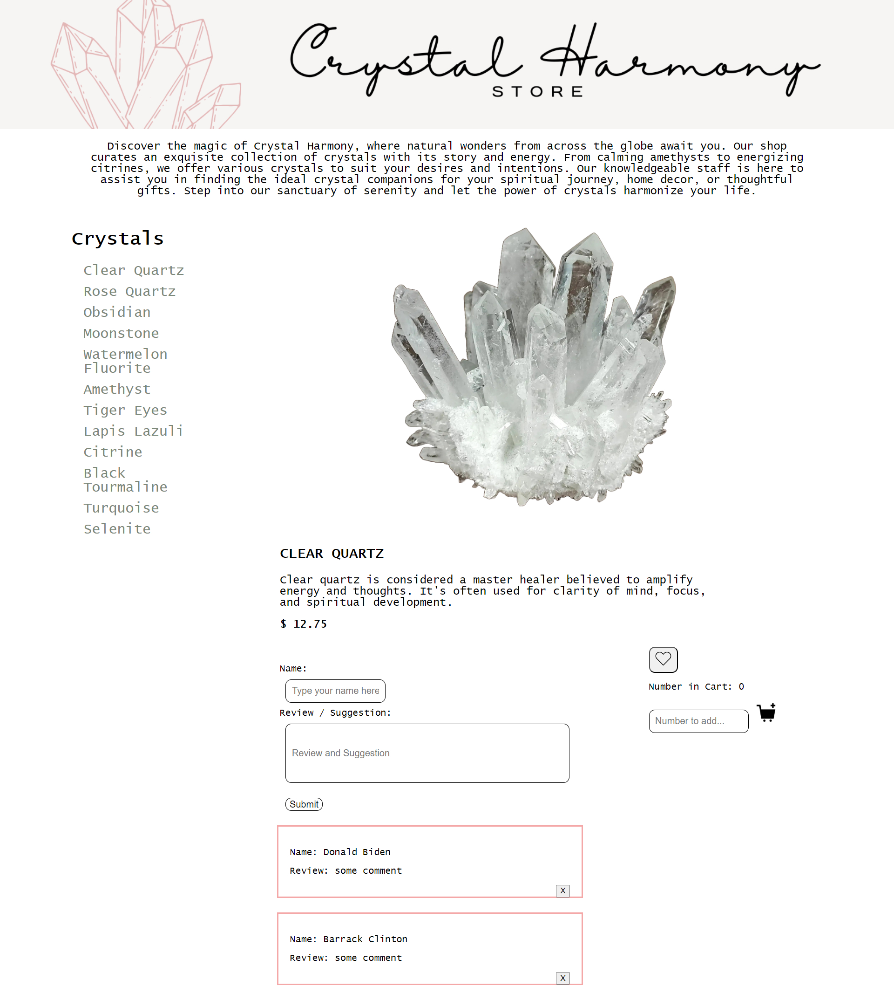

# Crystal Harmony Store

# "Elevate Your Energy, Embrace Your Essence: Crystal Harmony, Where Healing Begins!"

# You can run this command to run this server:

 json-server --watch db.json

# THE BASIC STORY OF THIS APPLICIATION:

Discover the magic of Crystal Harmony, where natural wonders from across the globe await you. Our shop curates an exquisite collection of crystals with its own story and energy. From calming amethysts to energizing citrines, we offer various crystals to suit your desires and intentions. Our knowledgeable staff is here to assist you in finding the ideal crystal companions for your spiritual journey, home decor, or thoughtful gifts. Step into our sanctuary of serenity and let the power of crystals harmonize your life.

# REASONS FOR CHOOSING CRYSTALS:

We believe Metaphysical properties of crystals for healing, energy cleansing, and spiritual practices. Crystals has natural element which give us the passion to connect to Earth’s resources to have a deeper connection with our spiritual wellness. Crystals comes in many various types, shapes and sizes and are unique and rare to the eyes as well as the artistic view.  Crystals can also become a piece of jewelry, home décor or an art piece. Crystals are believed to possess various metaphysical and healing properties, although it's important to note that these beliefs are not scientifically proven. Different crystals are thought to have other benefits, and their properties are often associated with specific chakras, intentions, or emotional states. Here are some common beliefs about the benefits of certain crystals:

# Core MVP:

Display the crystal pictures and names on the top of the page

When the pictures are clicked, customers will see the description of items (click)

When the mouse is hovering over the picture, it should glow. (mouse-over)

Like button, click to like and unlike

Add to cart feature (submit)

Add comment feature(submit)

# Requirements:

1.	Website was built with HTML/CSS/JS (Access data from DB.JSON)
2.	Only One Single Page
3.  Used PATCH, DELETE & POST Methods
4.	Click, Submit, Mouse Over and Mouse Out(4 distinct event listener)
5.	forEach(when we do get request)
6.	DON’T REPEAT YOURSELF: KEEP IT DRY!!!

# Crystals Stone List

1. **Amethyst**: Known for its calming energy, amethyst is often used to enhance spiritual awareness and intuition. It's also believed to aid in meditation and promote restful sleep.

2. **Rose Quartz**: Often called the "love stone," rose quartz is associated with love, compassion, and emotional healing. It's believed to attract love and enhance self-love and forgiveness.

3. **Citrine**: Citrine is associated with abundance, prosperity, and positive energy. It's believed to enhance creativity, motivation, and self-expression.

4. **Clear Quartz**: Clear quartz is considered a master healer believed to amplify energy and thoughts. It's often used for clarity of mind, focus, and spiritual development.

5. **Black Tourmaline**: Known for its protective properties, it is believed to absorb negative energy and promote security. It's often used for grounding and protection against electromagnetic fields.

6. **Lapis Lazuli**: Lapis lazuli is associated with wisdom, truth, and spiritual enlightenment. It's believed to enhance intellectual abilities, communication, and inner peace.

7. **Turquoise**: Turquoise is known for its healing properties and is often used for physical and emotional well-being. It's believed to promote balance, intuition, and positive thinking.

8. **Selenite**: Selenite is associated with clarity, purification, and spiritual connection. It's often used for cleansing energy, meditation, and promoting mental clarity.

9. **Turquoise**: Turquoise is known for its healing properties and is often used for physical and emotional well-being. It's believed to promote balance, intuition, and positive thinking.

10. **Watermelon Fluorite**: Watermelon fluorite helps to heal emotional scars, as well as heartbreak, past trauma, and emotional wounds. It allows us to open our hearts to love.

11. **Moonstone**: Moonstone is a form of feldspar that is milky-white and has iridescence. It evokes a feeling of mystery and magic, and helps with intuition and connection with the Divine Feminine.

12. **Tiger Eyes**: Tiger Eye is a shimmery golden-brown form of quartz. It supports resilience and balance while taking action aligned with one's goals and intention.

It's essential to choose crystals based on your intuition and personal connection with them. Many people use crystals as tools for meditation, energy work, and setting intentions, but their effectiveness varies from person to person. If you're interested in using crystals for their potential benefits, it's essential to research and learn about each crystal's properties and to trust your instincts and experiences.

